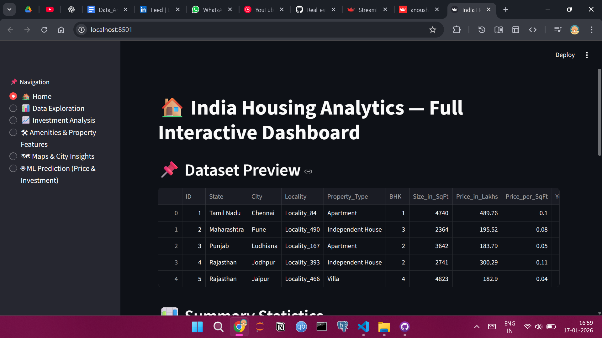

# 🏠 India Housing Analytics – Interactive Streamlit Dashboard

## 📌 Project Overview

**India Housing Analytics** is an end-to-end interactive data analytics and machine learning project built using **Streamlit**. The application analyzes Indian housing data to uncover **pricing trends, investment opportunities, property features, and city-wise insights**, and also provides **predictive models** for price estimation and investment classification.

The dashboard is designed for **exploratory analysis, decision support, and real-estate investment insights** through an intuitive, filter-driven interface.

---

## 🎯 Objectives

* Perform exploratory data analysis (EDA) on Indian housing data
* Analyze price trends across cities, states, and property types
* Identify good investment opportunities using engineered metrics
* Evaluate the impact of amenities and property features on pricing
* Build machine learning models for price prediction and investment classification
* Deliver insights through an interactive Streamlit dashboard

---

## 🧰 Tools & Technologies

* **Python**
* **Streamlit** – Interactive web application
* **Pandas, NumPy** – Data manipulation and analysis
* **Plotly** – Interactive visualizations
* **Scikit-learn** – Machine learning models (Random Forest)

---

## 📂 Repository Structure

```
├── app.py                          # Main Streamlit application
├── india_housing_engineered.csv    # Feature-engineered dataset
├── screenshots/                    # Dashboard screenshots
│   ├── Real_estate_investment_advisor_dashboard.png
│   ├── Real_estate_investment_advisor_prediction_status.png
├── requirements.txt                # Python dependencies
└── README.md
```

---

## 📊 Dashboard Modules

### 🏡 Home

* Dataset preview
* Summary statistics
* Overview of dashboard capabilities

### 📊 Data Exploration

* Interactive filters: price range, city, property type, BHK, furnishing, ready-to-move
* Price distribution and property size analysis
* Price vs size relationship across cities

### 📈 Investment Analysis

* Investment score distribution
* Good vs bad investment classification
* Top localities for investment

### 🛠 Amenities & Property Features

* Amenities vs price analysis
* Property age distribution
* Parking availability vs pricing impact

### 🗺 City & State Insights

* Average property price by city
* State-wise pricing trends
* Geographic insights for real estate comparison

### 🤖 Machine Learning Predictions

* **Price Prediction** using Random Forest Regressor (R² score shown)
* **Good Investment Classification** using Random Forest Classifier (accuracy shown)
* Automatic preprocessing with label encoding

---

## 📈 Key Insights

* Property prices vary significantly across cities and states
* Amenities and parking availability positively influence property prices
* Certain localities consistently score higher on investment potential
* Machine learning models achieve strong performance in predicting prices and investment quality

---

## 🚀 How to Run the Project Locally

1. Clone the repository

```bash
git clone https://github.com/your-username/india-housing-analytics.git
cd india-housing-analytics
```

2. Install dependencies

```bash
pip install -r requirements.txt
```

3. Run the Streamlit app

```bash
streamlit run app.py
```

4. Open the app in your browser (usually at `http://localhost:8501`)

---

## ⭐ Future Enhancements

* Add map-based visualizations using latitude & longitude
* Improve ML models with hyperparameter tuning
* Deploy the app on Streamlit Cloud
* Add user-driven prediction inputs

---

## Dashboard Image


## 👩‍💻 Author

**Anoushka Thakur**
Data Analyst | Python • SQL • Streamlit • Tableau • Power BI • Machine Learning

---

## 📬 Contact

Feel free to connect with me on **LinkedIn** for collaboration, feedback, or analytics opportunities.
